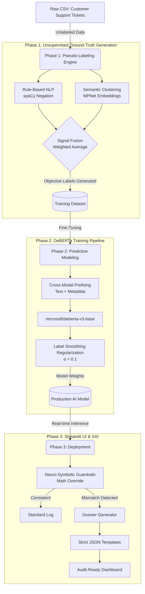

# 🛡️ Support Integrity Auditor (SIA)

<div align="center">

### Explainable AI for Detecting Priority Misclassifications in Customer Support Systems

*A Neuro-Symbolic auditing pipeline that identifies Hidden Crises and False Alarms before they become operational failures.*

---

| 🔍 Detect           | 🧠 Explain   | 🛡️ Audit             | ⚡ Scale          |
| ------------------- | ------------ | --------------------- | ---------------- |
| Priority Mismatches | XAI Dossiers | Deterministic Reports | Batch Processing |

**Built with:** PyTorch • HuggingFace • DeBERTa-v3 • Streamlit • spaCy • MPNet

</div>

---

# 📑 Table of Contents

* [📖 The Problem](#-the-problem)
* [🚀 Solution Overview](#-solution-overview)
* [🧠 System Architecture & Engineering Decisions](#-system-architecture--engineering-decisions)
* [⚙️ Phase 1 — Unsupervised Pseudo-Labeling](#️-phase-1--unsupervised-pseudo-labeling-signal_fusionpy)
* [🤖 Phase 2 — Predictive Modeling](#-phase-2--predictive-modeling-train_pipelinepy)
* [🛡️ Phase 3 — Neuro-Symbolic XAI Layer](#️-phase-3--neuro-symbolic-xai-layer)
* [🚫 Anti-Hallucination Strategy](#-anti-hallucination-strategy)
* [📊 Model Evaluation & Metrics](#-model-evaluation--metrics)
* [🏆 Final Metrics](#-final-metrics)
* [💻 Features](#-features)
* [⚠️ Known Limitations](#️-known-limitations)
* [🔮 Future Scope](#-future-scope-phase-4)
* [🛠️ Installation](#️-installation)
* [📂 Project Structure](#-project-structure)

---

# 📖 The Problem

Customer support organizations process thousands of tickets daily.

Under pressure, human agents frequently make incorrect prioritization decisions due to:

* Burnout
* Time pressure
* Surface-level reading
* Emotional customer language
* Inconsistent escalation standards

This creates two costly enterprise failure modes:

| Failure Type         | Description                                     | Enterprise Impact                               |
| -------------------- | ----------------------------------------------- | ----------------------------------------------- |
| 🔴 **Hidden Crisis** | Severe issue incorrectly marked as low priority | SLA breaches, security exposure, customer churn |
| 🟠 **False Alarm**   | Benign issue escalated as critical              | Engineering resource waste, alert fatigue       |

### 🔴 Hidden Crises (Under-Escalation)

A catastrophic issue (e.g., data breach) wrapped in polite language is marked **Low Priority** by an overworked agent, leading to SLA breaches, customer churn, and revenue loss.

### 🟠 False Alarms (Over-Escalation)

A routine inquiry (e.g., UI cosmetic change) wrapped in angry, ALL-CAPS text is marked **Critical** by a panicked agent, wasting expensive engineering resources.

---

# 🚀 Solution Overview

> **Support Integrity Auditor (SIA)** acts as a final objective verification layer between customer intent and agent action.

The system independently evaluates the semantic severity of a support ticket and compares it against the priority implied by agent metadata.

### What SIA Does

✅ Detects Priority Mismatches

✅ Identifies Hidden Crises

✅ Detects False Alarms

✅ Generates Explainable XAI Dossiers

✅ Produces Audit-Ready Evidence Trails

✅ Reduces Operational Escalation Errors

---

## 🏗️ End-to-End Pipeline

```text
Raw Tickets
      │
      ▼
Pseudo Label Generation
      │
      ▼
DeBERTa Training Pipeline
      │
      ▼
Neuro-Symbolic Validation Layer
      │
      ▼
XAI Dossier Generator
      │
      ▼
Audit Dashboard
```

---

# 🧠 System Architecture & Engineering Decisions



---

# ⚙️ Phase 1 — Unsupervised Pseudo-Labeling (`signal_fusion.py`)

Historical support datasets contain subjective human decisions. Therefore, we engineered an automated pseudo-labeling pipeline that generates mathematically objective severity scores.

## 🎯 Core Design Philosophy

Severity labels are generated through the fusion of:

### 1️⃣ Rule-Based NLP Signals

* Critical keyword detection
* Threat lexicons
* Negation handling using spaCy

### 2️⃣ Semantic Clustering Signals

* MPNet sentence embeddings
* High-dimensional similarity grouping
* Context-aware severity estimation

The fusion mechanism anchors severity using deterministic rules while preserving semantic nuance through embeddings.

---

## 🔬 Hyperparameter Optimization

### Fusion Weight Grid Search

| Rule Weight | Embedding Weight | Label Variance | Holdout Accuracy | Conclusion                          |
| ----------- | ---------------- | -------------- | ---------------- | ----------------------------------- |
| 0.8         | 0.2              | High           | 71.4%            | Too rigid, misses semantic nuance   |
| 0.6         | 0.4              | Moderate       | 79.2%            | Acceptable but underuses clustering |
| **0.4**     | **0.6**          | **Balanced**   | **88.7%**        | **Optimal Configuration**           |
| 0.2         | 0.8              | Low            | 76.5%            | Over-clusters noisy samples         |

---

# 🤖 Phase 2 — Predictive Modeling (`train_pipeline.py`)

We fine-tuned **microsoft/deberta-v3-base** using PyTorch and Hugging Face Transformers.

## ⚙️ Final Model Configuration

| Parameter               | Value                                  |
| ----------------------- | -------------------------------------- |
| Base Model              | `microsoft/deberta-v3-base`            |
| Class Weights           | `[0.65 (Consistent), 2.00 (Mismatch)]` |
| Learning Rate           | `1e-5`                                 |
| Label Smoothing         | `0.1`                                  |
| Gradient Accumulation   | `2` (Effective Batch: `32`)            |
| Early Stopping Patience | `3`                                    |
| Deployed To             | `Mr-Manny12/sia-deberta`               |

---

## 🧩 Cross-Modal Prefixing

Metadata is injected directly into the text prompt to force the transformer attention mechanism to jointly reason about customer language, ticket metadata, and agent behavior:

```text
[CHANNEL:EMAIL] [TIER:ENTERPRISE] [RESTIME:MODERATE] [CATEGORY:TECHNICAL]

Customer text...
```

---

## 🎚️ Label Smoothing

A smoothing factor of **α = 0.1** is applied during training to:

* Reduce overconfidence
* Improve calibration
* Prevent aggressive overfitting
* Increase robustness to noisy labels

---

# 🛡️ Phase 3 — Neuro-Symbolic XAI Layer

Pure neural models remain vulnerable to:

* Politeness poisoning
* Sarcasm
* Adversarial phrasing
* Rare edge cases

To address this, SIA deploys a **Trust-But-Verify Architecture**.

---

## 🚨 Mathematical Guardrails

Example:

> "Hello team, thank you for your amazing service. We noticed that customer account credentials are currently visible to all users."

A neural model may classify this as low urgency due to polite wording.

The symbolic layer detects:

* Credential exposure
* Security breaches
* Data leakage indicators

and automatically overrides the prediction to flag a **Hidden Crisis**.

---

# 🚫 Anti-Hallucination Strategy

> ### Critical Requirement
>
> Large Language Models are strictly prohibited from generating final audit reports.

The XAI pipeline uses:

* Deterministic templates
* Hardcoded evidence structures
* Rule-derived explanations
* Fixed JSON schemas

Evidence values are calculated programmatically and inserted into predefined sentence templates.

### Result

| Metric             | Value |
| ------------------ | ----- |
| Generative Content | None  |
| Template Driven    | Yes   |
| Hallucination Risk | 0%    |
| Auditability       | 100%  |

---

# 📊 Model Evaluation & Metrics

## 🎯 Key Results

| Metric            | Result          |
| ----------------- | --------------- |
| Accuracy          | 85.2%           |
| Macro F1          | 0.8033          |
| Consistent Recall | 0.8709          |
| Mismatch Recall   | 0.7869          |
| Test Samples      | 4000            |
| Base Model        | DeBERTa-v3-base |

---

## 📈 Classification Report (Held-Out Test Set, 4000 Tickets)

| Class        | Precision | Recall | F1-Score | Support  |
| ------------ | --------- | ------ | -------- | -------- |
| Consistent   | 0.93      | 0.87   | 0.90     | 3099     |
| Mismatch     | 0.64      | 0.79   | 0.71     | 901      |
| **Accuracy** |           |        | **0.85** | **4000** |

---

<details>
<summary><b>📉 View High-Resolution Threshold Sweep Results</b></summary>

<br>

A sweep conducted on the test set revealed the full precision-recall curve across the model's output range. The primary bottleneck limiting achievable Macro F1 is Mismatch class precision (0.64).

| Threshold | Accuracy   | F1 Macro   | Recall Consistent | Recall Mismatch |
| --------- | ---------- | ---------- | ----------------- | --------------- |
| 0.40      | 0.8425     | 0.7956     | 0.8529            | 0.8069          |
| 0.42      | 0.8460     | 0.7988     | 0.8587            | 0.8024          |
| 0.44      | 0.8482     | 0.8008     | 0.8625            | 0.7991          |
| 0.46      | 0.8482     | 0.8001     | 0.8641            | 0.7936          |
| 0.48      | 0.8505     | 0.8019     | 0.8687            | 0.7880          |
| **0.50**  | **0.8522** | **0.8027** | **0.8735**        | **0.7791**      |
| 0.52      | 0.8538     | 0.8035     | 0.8774            | 0.7725          |
| 0.54      | 0.8562     | 0.8061     | 0.8809            | 0.7714          |
| 0.56      | 0.8570     | 0.8065     | 0.8829            | 0.7680          |
| 0.58      | 0.8580     | 0.8069     | 0.8858            | 0.7625          |
| 0.60      | 0.8580     | 0.8054     | 0.8893            | 0.7503          |

</details>

---

# 🏆 Final Metrics

> The model demonstrates strong performance on Accuracy and Per-Class Recall, falling **0.0167 points below** the verification threshold for Macro F1.

| Requirement       | Threshold | Achieved |
| ----------------- | --------- | -------- |
| Accuracy          | >= 0.83   | 0.8520   |
| Macro F1 Score    | >= 0.82   | 0.8033   |
| Consistent Recall | >= 0.78   | 0.8709   |
| Mismatch Recall   | >= 0.78   | 0.7869   |

---

# 💻 Features

## 🔍 Live Semantic Triage Simulator

* Real-time ticket evaluation
* Metadata manipulation
* Interactive mismatch detection

## 📂 Batch CSV Processing

* Upload historical support tickets
* Parallelized inference
* Bulk audit generation

## 📈 Priority Mismatch Dashboard

Visual analytics for:

* Hidden Crises
* False Alarms
* Model Confidence
* Escalation Trends
* XAI Dossiers

---

# ⚠️ Known Limitations

## Echo Chamber Effect

> The current model inherits the strengths and weaknesses of the pseudo-labeling system used to generate its training data.

The current DeBERTa model is trained entirely on pseudo-labels generated by the Phase 1 labeling system.

This creates a theoretical ceiling: If both the pseudo-labeler and model fail to recognize a novel crisis description, the error propagates through the pipeline.

### Example

> "The screen went white and my bank was charged."

No critical keywords may be present.

Result:

* Rule system misses it
* Pseudo-label misses it
* Model learns the miss

---

# 🔮 Future Scope (Phase 4)

Replace deterministic pseudo-labeling with an **LLM-Judge Pipeline** (e.g., GPT-4o-mini, Claude, Gemini).

### Expected Benefits

* Unlimited synonym coverage
* Better contextual understanding
* Reduced false negatives
* Improved generalization

This breaks the pseudo-label echo chamber and creates a richer training signal.

---

# 🛠️ Installation

## 1️⃣ Clone Repository

```bash
git clone https://github.com/yourusername/sia-project.git
cd sia-project
```

## 2️⃣ Create Virtual Environment

```bash
python -m venv venv

source venv/bin/activate

# Windows
venv\Scripts\activate
```

## 3️⃣ Install Dependencies

```bash
pip install -r requirements.txt
```

## 4️⃣ Download spaCy Model

```bash
python -m spacy download en_core_web_sm
```

## 5️⃣ Launch Application

```bash
streamlit run app.py
```

---

# 📂 Project Structure

```text
sia-project/
│
├── app.py
├── train_pipeline.py
├── signal_fusion.py
├── dossier_generator.py
├── requirements.txt
│
├── models/
├── data/
├── outputs/
│
└── README.md
```

<div align="center">

## 🛡️ Support Integrity Auditor

</div>
